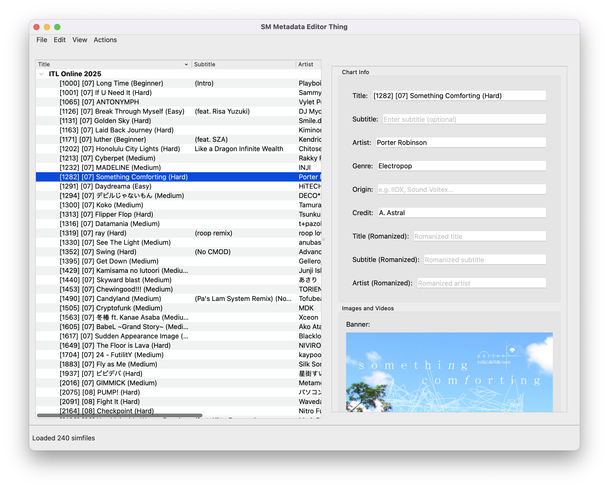

# SM Metadata Editor Thing

### A graphical tool for bulk-editing Stepmania simfiles

This is a tool for editing simfile info, basically all of the stuff that's _not_ stepcharts.

**This is still very much a work in progress. Don't use it on any files you can't easily replace.**

## Install/Run

> You should probably do this in a virtual environment!

Clone this repo, and then install the package and dependencies with `pip3 install -e .` 

You can run it by calling `sm-metadata-editor`

### Current Features:
- Edit fields individually or in bulk
- Preview banner images and videos
- Edit banners, backgrounds, jackets, CD title images
- Edit audio preview
- Search for song genres based on data from last.fm, discogs, and animethemes.moe (add api keys in `Settings` menu)

### Todos:
- song preview playback on linux is broken
- test stuff on Windows
- fix styling issues when dark theme is enabled by OS
- figure out a way to set preferences for genre selection

### Got other ideas for what this should do?

I built this to solve a slightly specific issue for myself, but if you've got suggestions for other features, let me know! Open an issue or discussion or something.